<div align="center">

# SecureGuard

### Your Safety. One Tap Away.

**A Mobile Application for Personal Safety and Emergency Assistance**

Built with Flutter • Material 3 • Final-year university project

</div>

---

## Table of Contents

1. [Project Overview](#1-project-overview)
2. [Problem Statement](#2-problem-statement)
3. [Project Objectives](#3-project-objectives)
4. [Key Features](#4-key-features)
5. [Technologies Used](#5-technologies-used)
6. [System Requirements](#6-system-requirements)
7. [Installation](#7-installation)
8. [How to Run](#8-how-to-run)
9. [Demo Login](#9-demo-login)
10. [Application Screens](#10-application-screens)
11. [Project Structure](#11-project-structure)
12. [Testing](#12-testing)
13. [Security & Privacy](#13-security--privacy)
14. [Implemented vs. Simulated Features](#14-implemented-vs-simulated-features)
15. [Future Improvements](#15-future-improvements)
16. [Limitations](#16-limitations)
17. [Conclusion](#17-conclusion)

---

## 1. Project Overview

**SecureGuard** is a mobile application that helps people respond quickly when
they feel unsafe. It brings the things a person actually needs during an
emergency into a single, calm screen: one button that alerts the people they
trust, their live location, direct numbers for the emergency services, and a
record of everything that happened.

The application was built as a final-year university mobile-development
project. It is a complete, runnable Flutter application with fifteen screens,
working navigation, local data persistence, form validation, an automated test
suite and light/dark themes. Where a feature would normally require a paid
backend service — SMS gateways, push notifications, a map SDK or a real GPS
provider — SecureGuard ships a clearly labelled simulation so the whole user
journey can still be demonstrated end to end on any device.

**Tagline:** *Your Safety. One Tap Away.*

---

## 2. Problem Statement

People are most at risk in exactly the moments when using a phone is hardest.
Someone walking home after an evening class, travelling alone, or caught in a
medical emergency may have only a few seconds and one free hand.

In those moments the tools that could help are scattered and slow:

- **The phone book is too slow.** Unlocking a phone, opening contacts,
  searching for a family member and dialling takes far too long under stress.
- **Nobody knows where you are.** A phone call cannot easily communicate a
  precise location, and describing an unfamiliar street is difficult.
- **Emergency numbers are not memorised.** Many people do not know the local
  ambulance or fire number, and searching for it wastes critical time.
- **One person can only be reached at a time.** A call reaches one contact; an
  emergency often needs several people alerted at once.
- **There is no record afterwards.** When an incident has to be reported
  later, people rarely remember the exact time and place.

SecureGuard addresses all five problems from one screen.

---

## 3. Project Objectives

**Main aim:** to design and build a mobile application that lets a person
request help, share their location and reach the emergency services with the
smallest possible number of actions.

**Specific objectives:**

1. Provide a single, prominent SOS control that alerts every trusted contact
   at once, with the user's identity and position.
2. Protect against accidental activation with a deliberate press-and-hold
   gesture followed by a cancellable countdown.
3. Let users manage a list of trusted contacts and choose who is alerted first.
4. Display the user's location and allow live sharing that can be started and
   stopped at any time.
5. Offer one-tap access to police, ambulance, fire and hotline services.
6. Keep a permanent, readable history of every safety event.
7. Deliver all of this in an interface that is clear, accessible and usable
   under stress, in both light and dark themes.
8. Collect the minimum amount of personal data required, and explain in the
   application exactly what is stored and where.

---

## 4. Key Features

| Feature | What it does |
|---|---|
| **Emergency SOS** | Press and hold for 3 seconds, confirm through a cancellable countdown, then every trusted contact is notified one by one while live location sharing starts automatically. |
| **Cancellable countdown** | A configurable 3–15 second window (5 s by default) during which a mistaken alert can be stopped. Cancelled attempts are still logged, with nobody notified. |
| **Trusted contacts** | Add, edit, delete and reorder the people who are alerted. One contact is always the *primary* contact and is alerted first. Duplicate numbers are rejected. |
| **Live location sharing** | A map view with the current position, accuracy radius and a live indicator. Sharing is started and stopped explicitly by the user, and the position updates while it runs. |
| **Emergency services** | Police, ambulance, fire and hotline numbers grouped by category, each with a call button that opens the device dialler after a confirmation. |
| **Emergency history** | Every SOS alert, cancellation, location share, service call and safety check-in is recorded with date, time, place, status and who was notified. Filterable by type. |
| **Safety tips** | Fifteen pieces of practical advice across five categories: personal, travel, night, online and emergency preparedness. |
| **Notification centre** | In-app notifications generated as the user acts, with unread counts, swipe-to-dismiss and mark-all-read. |
| **Profile & settings** | Editable profile, notification and permission toggles, SOS countdown length, dark mode, language preference, password change, privacy statement and logout. |
| **Light & dark themes** | A complete Material 3 theme in both modes, with accent colours that adapt so nothing loses contrast on dark surfaces. |

---

## 5. Technologies Used

| Layer | Choice | Why |
|---|---|---|
| Framework | **Flutter 3.47** | One codebase for Android, iOS and web; excellent for a student project. |
| Language | **Dart 3.13** | Sound null safety, pattern matching and records. |
| Design system | **Material 3** | Modern components, built-in theming and accessibility support. |
| State management | **provider 6** (`ChangeNotifier`) | Simple and readable — easy to explain in a viva, unlike heavier alternatives. |
| Persistence | **shared_preferences 2** | Key/value storage for contacts, history, notifications and settings. |
| Platform calls | **url_launcher 6** | Opens the device dialler and SMS composer. |
| Testing | **flutter_test**, **fake_async** | 78 unit and widget tests, including timer-driven SOS flows. |
| Linting | **flutter_lints 6** | Enforces the standard Dart/Flutter style; the project has zero analyzer issues. |

Only three runtime dependencies are used. Date formatting, the map view and the
SecureGuard logo are all implemented from scratch inside the project, which
keeps the dependency surface small and the code easy to read.

---

## 6. System Requirements

**To build and run:**

- Flutter SDK **3.27 or newer** (developed and tested on 3.47.5)
- Dart SDK **3.13 or newer** (bundled with Flutter)
- One of:
  - Android Studio / Android SDK with an emulator or device (Android 6.0+)
  - Xcode 15+ with an iOS simulator or device (iOS 13+) — macOS only
  - Google Chrome (for the web build)
- Roughly 3 GB of free disk space for the Flutter toolchain

**To run the demonstration only:** any modern browser is enough, using the web
build described below.

---

## 7. Installation

```bash
# 1. Get the source code
git clone <repository-url>
cd secureguard-mobile-app

# 2. Confirm your toolchain is ready
flutter doctor

# 3. Install the project dependencies
flutter pub get
```

That is the whole setup. There is no backend to configure, no API key to
obtain and no `.env` file to create.

---

## 8. How to Run

### On a phone or emulator

```bash
flutter devices          # list what is connected
flutter run              # run on the default device
flutter run -d <device>  # or choose one explicitly
```

### In a browser (easiest for a classroom demonstration)

```bash
flutter run -d chrome
```

### Build a release package

```bash
flutter build apk --release     # Android APK  -> build/app/outputs/flutter-apk/
flutter build appbundle         # Google Play bundle
flutter build ios --release     # iOS (macOS only)
flutter build web --release     # Web bundle   -> build/web/
```

The web build bundles its own rendering engine, so `build/web/` can be served
by any static web server and works without an internet connection:

```bash
cd build/web && python3 -m http.server 8080
```

### Run the checks

```bash
flutter analyze   # static analysis (expected: "No issues found!")
flutter test      # full test suite  (expected: "All tests passed!")
```

---

## 9. Demo Login

The application ships with a pre-configured demonstration account. On the login
screen the credentials are printed on a card, and the **Use demo account**
button fills them in with one tap.

| Field | Value |
|---|---|
| **Email** | `anisa@example.com` |
| **Password** | `Secure123` |

Signing in with this account loads the full demonstration data set: the user
**Anisa Abdi**, three trusted contacts, five historical safety events and five
notifications.

You can also register a new account from the **Create account** screen. New
accounts are stored on the device only.

> **Recommended demonstration path**
> Splash → Onboarding → Login (demo account) → Dashboard → hold **SOS** →
> countdown → alert sent → contacts notified → location shared → **I'm safe** →
> History shows the new event.

---

## 10. Application Screens

Fifteen screens, all reachable and all complete.

| # | Screen | Purpose |
|---|---|---|
| 1 | **Splash** | Animated logo, app name, tagline; restores the previous session and routes onward. |
| 2 | **Onboarding** | Three pages — Stay Safe Anywhere, Emergency Assistance, Your Location Your Protection — with page indicators, Skip and Get Started. |
| 3 | **Login** | Email, password with show/hide, Remember me, Forgot password, Create account, demo credentials card. |
| 4 | **Sign Up** | Full name, email, phone, password with a live strength meter, confirm password, and a prototype-acknowledgement checkbox. |
| 5 | **Forgot Password** | Reset-link request with an honest note that no mail server exists in the prototype. |
| 6 | **Dashboard (Home)** | Greeting, safety-status card, the large SOS button, quick actions, trusted contacts, location summary and recent activity. |
| 7 | **SOS Emergency** | Countdown with cancel, dispatch progress, then the live alert view with time, location, contacts notified and end-emergency controls. |
| 8 | **Trusted Contacts** | Full contact management with primary-contact selection and duplicate-number protection. |
| 9 | **Emergency Services** | Police, ambulance, fire and hotline services grouped by category, each with a call button. |
| 10 | **Live Location** | Map view, coordinates, accuracy, start/stop sharing and the list of contacts currently receiving the location. |
| 11 | **Safety Tips** | Five tabbed categories with fifteen expandable advice cards. |
| 12 | **Emergency History** | Filterable event log with a summary of totals. |
| 13 | **Event Details** | Full record of one event: timeline, map, contacts notified and notes. |
| 14 | **Notifications** | Notification centre with unread state, dismiss and mark-all-read. |
| 15 | **Profile / Settings / About / Privacy / Edit Profile / Change Password** | Account details, protection statistics and every preference, plus the About and Privacy statements. |

Screenshots of each screen are in [`docs/screenshots/`](docs/screenshots/),
captured from the running application.

| Splash | Onboarding | Login |
|---|---|---|
| 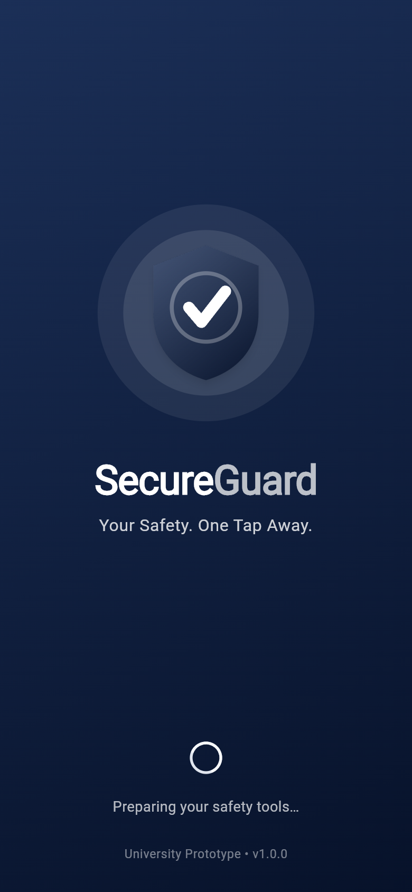 | 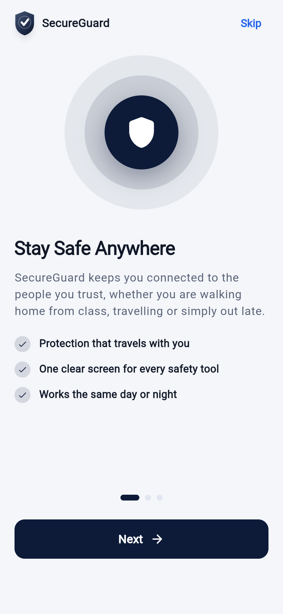 | 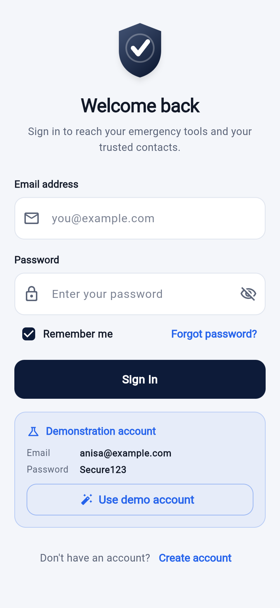 |

| Dashboard | SOS countdown | Alert sent |
|---|---|---|
| 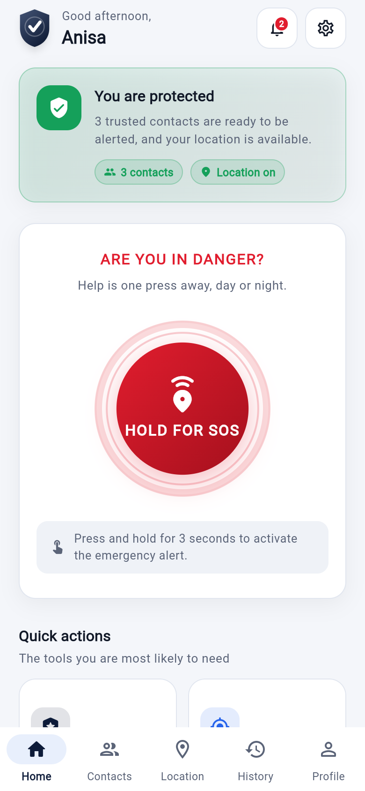 | 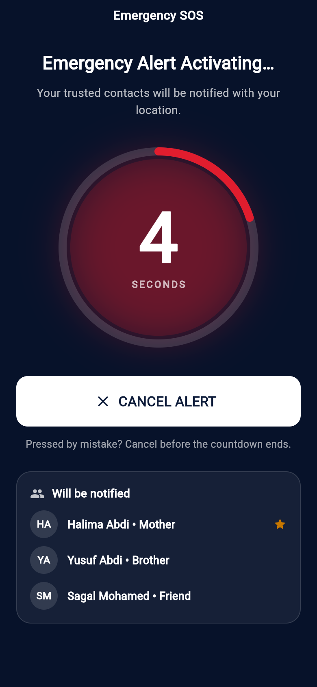 | 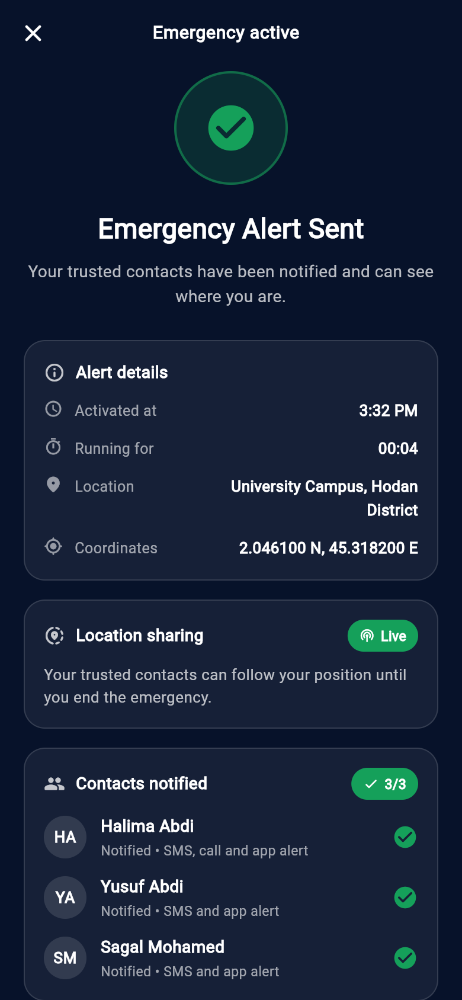 |

| Trusted contacts | Live location | History |
|---|---|---|
| 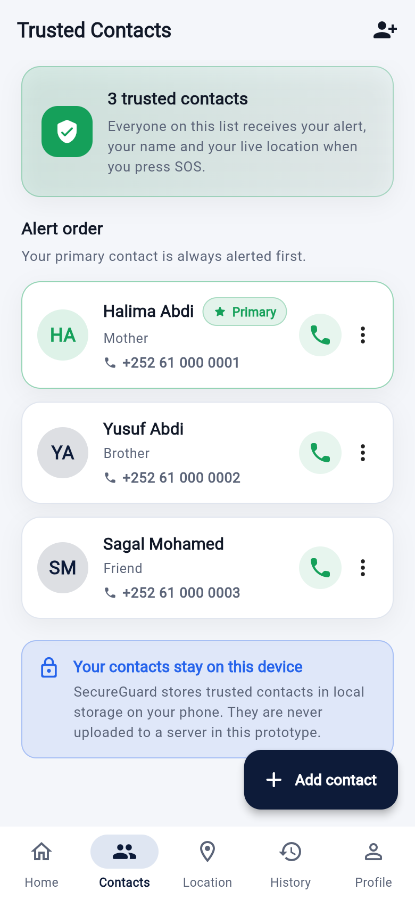 | 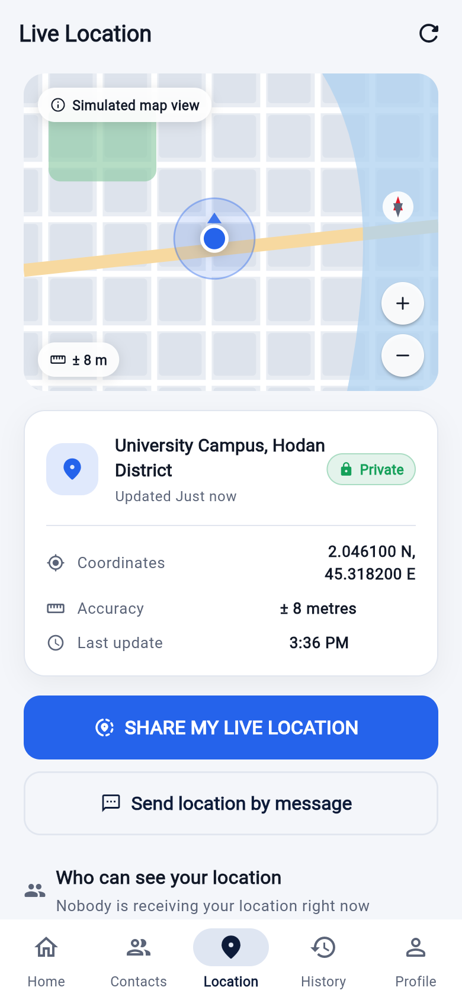 | 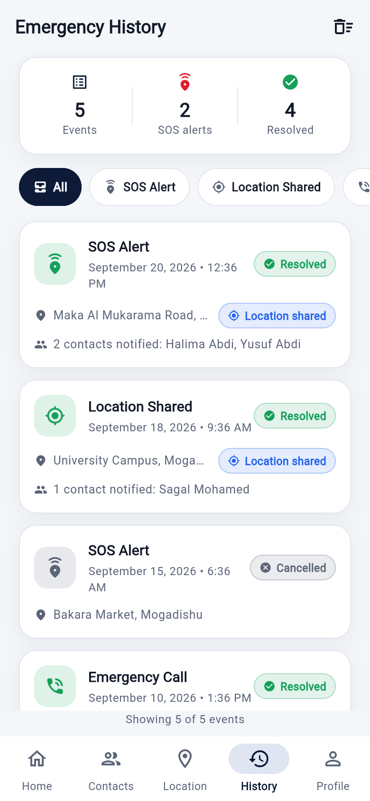 |

| Emergency services | Safety tips | Dark mode |
|---|---|---|
| 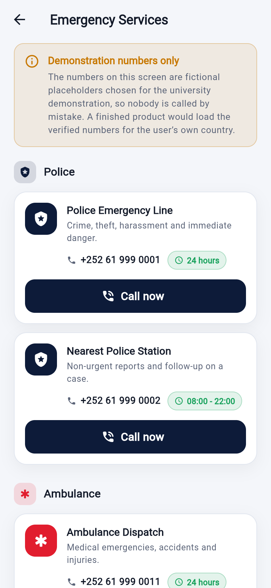 | 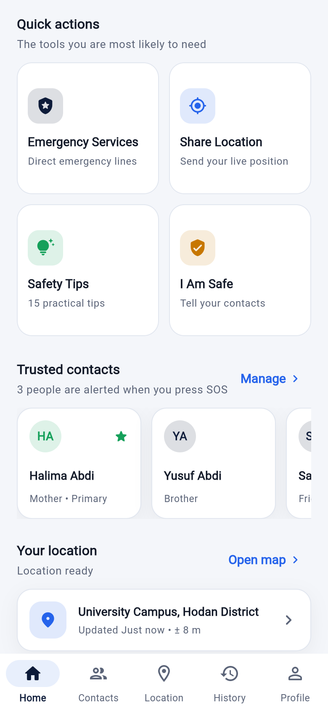 | 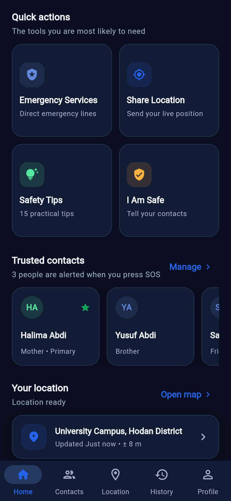 |

---

## 11. Project Structure

```
secureguard-mobile-app/
├── lib/
│   ├── main.dart                      # Entry point, providers, route table
│   │
│   ├── models/                        # Plain data classes
│   │   ├── app_user.dart
│   │   ├── emergency_contact.dart
│   │   ├── emergency_event.dart
│   │   ├── emergency_service.dart
│   │   ├── safety_tip.dart
│   │   ├── app_notification.dart
│   │   └── location_status.dart
│   │
│   ├── data/                          # Seed data and storage
│   │   ├── demo_data.dart             # Demo user, contacts, history, tips
│   │   └── local_store.dart           # Safe SharedPreferences wrapper
│   │
│   ├── services/                      # Logic with no UI
│   │   ├── auth_service.dart          # Sign in, register, change password
│   │   ├── alert_service.dart         # Dispatches alerts to contacts
│   │   ├── location_service.dart      # Simulated GPS feed
│   │   └── dialer_service.dart        # Phone dialler and SMS composer
│   │
│   ├── providers/                     # ChangeNotifier state holders
│   │   ├── auth_provider.dart
│   │   ├── contacts_provider.dart
│   │   ├── emergency_provider.dart    # The SOS state machine
│   │   ├── location_provider.dart
│   │   ├── notifications_provider.dart
│   │   └── settings_provider.dart
│   │
│   ├── screens/                       # One folder per feature area
│   │   ├── splash/
│   │   ├── onboarding/
│   │   ├── auth/                      # login, sign up, forgot password
│   │   ├── home/                      # dashboard + bottom-navigation shell
│   │   ├── sos/
│   │   ├── contacts/
│   │   ├── services/
│   │   ├── location/
│   │   ├── tips/
│   │   ├── history/
│   │   ├── notifications/
│   │   ├── profile/
│   │   └── settings/
│   │
│   ├── widgets/                       # Reusable UI building blocks
│   │   ├── sg_logo.dart               # Shield logo + wordmark (CustomPainter)
│   │   ├── sos_button.dart            # Press-and-hold button
│   │   ├── mock_map.dart              # Drawn map view
│   │   ├── sg_card.dart               # Standard card + icon badge
│   │   ├── sg_text_field.dart         # Labelled input + dropdown
│   │   ├── contact_tile.dart          # Contact row + avatar
│   │   ├── quick_action_tile.dart
│   │   ├── section_header.dart
│   │   ├── status_pill.dart
│   │   ├── empty_state.dart
│   │   └── app_feedback.dart          # Snack bars, dialogs, banners
│   │
│   ├── theme/
│   │   ├── app_colors.dart            # Palette + dark-mode adaptation
│   │   └── app_theme.dart             # Material 3 light and dark themes
│   │
│   └── utils/
│       ├── validators.dart            # All form validation rules
│       ├── formatters.dart            # Date, time and duration helpers
│       ├── responsive.dart            # Breakpoints and width capping
│       └── app_routes.dart            # Named route constants
│
├── test/
│   ├── validators_test.dart           # 12 tests
│   ├── formatters_test.dart           # 12 tests
│   ├── auth_service_test.dart         # 10 tests
│   ├── contacts_provider_test.dart    # 11 tests
│   ├── emergency_flow_test.dart       # 12 tests (SOS state machine)
│   ├── widget_flow_test.dart          # 21 widget tests
│   └── helpers/test_app.dart          # Shared test scaffolding
│
├── docs/
│   ├── PROJECT_DOCUMENTATION.md       # Full university write-up
│   ├── TESTING.md                     # Test plan and results
│   └── screenshots/                   # Captured from the running app
│
├── android/  ios/  web/               # Platform projects
├── pubspec.yaml
└── README.md
```

**Architectural idea in one sentence:** screens only draw and collect input,
providers hold state and coordinate, services do the work, and models carry
data — so any one layer can be changed without touching the others.

---

## 12. Testing

The project has an automated suite of **78 tests** covering validation rules,
the SOS state machine, contact management, location sharing and the user
interface itself.

```bash
flutter test
```

```
00:13 +78: All tests passed!
```

Static analysis is also clean:

```bash
flutter analyze
```

```
No issues found!
```

The full test plan, including every documented test case and how each one was
verified, is in **[`docs/TESTING.md`](docs/TESTING.md)**. A short summary:

| Area | Test cases | Status |
|---|---|---|
| Authentication | 14 | ✅ Pass |
| Trusted contacts | 12 | ✅ Pass |
| SOS activation and cancellation | 13 | ✅ Pass |
| Location sharing | 7 | ✅ Pass |
| Emergency services | 4 | ✅ Pass |
| History and notifications | 7 | ✅ Pass |
| Settings, theme and session | 8 | ✅ Pass |
| Persistence and resilience | 4 | ✅ Pass |

---

## 13. Security & Privacy

SecureGuard is a personal safety application, so it is built around the
principle of collecting **as little as possible**.

**What the application stores** — name, email and phone number; trusted
contacts; the current position while the app is open; and the emergency
history. All of it lives in local storage on the device.

**What the application never does** — no microphone, camera or photo access;
no scraping of the phone's contact list; no advertising identifiers; no
analytics; no background location; and no transmission of anything to a server.

**Protections that are genuinely implemented:**

- Every form validates its input before it is accepted.
- Passwords are hidden by default, with an explicit show/hide control.
- Registration enforces a minimum password strength (8+ characters, letters
  and numbers) and shows a live strength meter.
- SOS requires a deliberate three-second hold **and** a countdown, so it cannot
  fire by accident.
- Location sharing never starts silently — the user confirms it every time.
- Destructive actions (delete a contact, clear history, log out) are confirmed.
- Trusted contacts can be hidden from lock-screen notification previews.

**Honest statement of what is *not* production-grade.** This is a university
prototype. Account details are saved in ordinary device storage and passwords
are **not hashed**. There is no encryption at rest, no server-side
authentication, no certificate pinning and no independent security review. A
real release would need hashed credentials, encrypted storage, a secure
backend and a professional penetration test before anybody relied on it.

This statement is repeated inside the application itself, on the
**Settings → Privacy & data** screen, so a user of the demo is never misled.

---

## 14. Implemented vs. Simulated Features

Being explicit about this distinction is part of the project's honesty about
its own scope.

### Fully implemented and working

- Complete navigation across all fifteen screens, including bottom navigation
  with preserved tab state
- Sign in, registration, password change and logout against locally stored
  accounts
- The entire SOS state machine: hold → countdown → cancel or activate →
  per-contact dispatch → live alert → end emergency
- Trusted-contact create, edit, delete, set-primary and duplicate detection
- Start and stop location sharing, with the position updating while live
- Emergency history: automatic recording, filtering, detail view, delete and
  clear
- In-app notifications with unread counts, dismiss and mark-all-read
- All settings, including a working dark mode and an adjustable SOS countdown
- Local persistence — contacts, history, notifications, settings and the
  session survive an app restart
- Form validation and friendly error messages throughout
- Light and dark Material 3 themes with responsive layouts

### Deliberately simulated (and labelled as such in the app)

| Simulated | Why | What happens instead |
|---|---|---|
| **SMS / push delivery to contacts** | Needs a paid SMS gateway and a push service | `AlertService` dispatches to each contact in turn and the UI shows them being notified one by one |
| **GPS positioning** | Needs device hardware and permissions that are unavailable on desktop and in emulators | `LocationService` produces a realistic drifting position so the map and sharing flow work everywhere |
| **Map tiles** | Google Maps / Mapbox need an API key and a billing account | `MockMap` draws a stylised street grid, park, water, marker, accuracy circle and compass with `CustomPainter` |
| **Password-reset email** | Needs a mail server | The flow is shown in full, with a banner stating that no email is sent |
| **Emergency service numbers** | Publishing wrong emergency numbers would be harmful | Clearly fictional demonstration numbers, with a banner explaining this |
| **Phone calls on desktop/web** | No telephony on those platforms | The dialler is opened on a real phone; elsewhere a clearly labelled demo dialog appears and the attempt is still logged to history |

Every simulation lives behind a single service class, so replacing it with a
real implementation means changing one file, not the user interface.

---

## 15. Future Improvements

1. **A secure backend** — server-side accounts with hashed passwords,
   encrypted storage and synchronisation across devices.
2. **Real SMS and push delivery** through a gateway such as Twilio plus
   Firebase Cloud Messaging, so alerts reach contacts who do not have the app.
3. **Real GPS and maps** using `geolocator` and the Google Maps SDK, replacing
   `LocationService` and `MockMap`.
4. **Full localisation** — the language setting is already stored; translating
   the interface into Somali and Arabic with `flutter_localizations` is the
   next step.
5. **Background and hardware activation** — a shake gesture, a power-button
   sequence or a wearable, so SOS works without unlocking the phone.
6. **Audio and video evidence** — automatic recording during an alert, stored
   securely for later reporting.
7. **Safe-route guidance** — suggesting well-lit, busier routes at night.
8. **A responder view** — a web page where a notified contact can watch the
   live location and confirm they are on their way.
9. **Offline SMS fallback** — sending the alert by SMS when there is no data
   connection.
10. **Accessibility certification** — a formal audit against WCAG 2.2 and the
    platform accessibility guidelines.

---

## 16. Limitations

The project is deliberately scoped to what one student can build and defend.
Its known limitations are:

- **No backend.** All data is on the device; nothing synchronises and nothing
  is recoverable if the app is uninstalled.
- **Not production-secure.** Passwords are stored unhashed in device storage
  (see [Security & Privacy](#13-security--privacy)).
- **Alerts do not leave the device.** Contacts are notified inside the
  simulation, not by real SMS or push.
- **The position is simulated.** The coordinates come from a generated feed,
  not from the device's GPS.
- **The map is drawn, not real.** It is a convincing illustration, not a
  geographic map with searchable places.
- **Emergency numbers are fictional.** They must be replaced with verified
  local numbers before any real use.
- **English only.** The language preference is saved but the interface is not
  yet translated.
- **Portrait only.** The layout is locked to portrait, as safety apps
  typically are.
- **No background execution.** The app must be open for SOS to be triggered.

> ⚠️ **SecureGuard is a university prototype. It must not be relied on during a
> genuine emergency — call your local emergency number instead.**

---

## 17. Conclusion

SecureGuard set out to answer a narrow but important question: *how few actions
can stand between a person in danger and the help they need?* The answer this
project arrived at is one press, held for three seconds, with a countdown that
can still be cancelled.

Everything else in the application supports that single moment. Trusted
contacts exist so the alert has somewhere to go. Location sharing exists so
help can find the user. The history exists so the incident can be reported
afterwards. The safety tips exist so the button is needed less often.

Technically, the project demonstrates a complete Flutter application built to a
professional standard: a layered architecture that separates UI, state, logic
and data; a consistent Material 3 design system in light and dark themes; 68
automated tests and a clean static analysis; and local persistence that makes
the demonstration feel like a real product.

Just as importantly, the project is honest about its own boundaries. Every
simulated feature is labelled inside the application, and the privacy screen
states plainly that the prototype is not production-secure. A safety
application that overstated its capabilities would be worse than no application
at all — and recognising that is itself part of the engineering.

---

<div align="center">

**SecureGuard v1.0.0** • University Prototype • Built with Flutter

*Your Safety. One Tap Away.*

</div>
